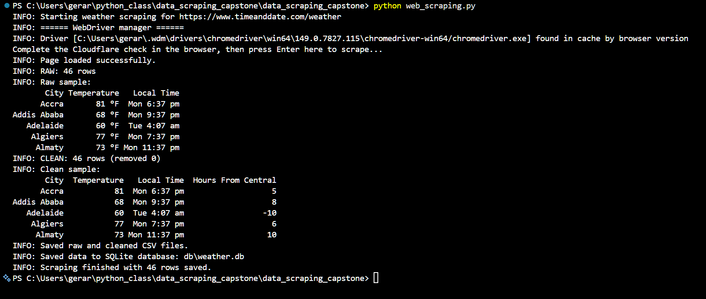

# Data Scraping Capstone — Global Weather Scraper

A Python web-scraping project that collects current weather readings for cities
around the world from [timeanddate.com/weather](https://www.timeanddate.com/weather),
cleans and transforms the data, and saves it to both CSV files and a SQLite
database.

## Summary

The scraper uses **Selenium** to load the timeanddate.com weather page, extracts
each city's name, current temperature, and local time, then cleans and
transforms the results. Outputs:

- `weather_raw.csv` / `weather_raw` table — the data exactly as scraped
  (temperature still a string, e.g. `81 °F`).
- `weather_clean.csv` / `weather_clean` table — a cleaned version with
  duplicates removed, whitespace trimmed, temperature converted to a numeric
  column, and an added `Hours From Central` column.
- `db/weather.db` — a SQLite database holding both tables.

The script logs a before/after report so you can see how many rows were dropped
during cleaning and compare a sample of the raw vs. cleaned data.

## Project structure

```
data_scraping_capstone/
├── web_scraping.py      # Scraper + cleaning + transform + save (CSV and SQLite)
├── database.py          # Loads the CSVs, shows before/after, writes to SQLite
├── weather_raw.csv      # Raw scraped output
├── weather_clean.csv    # Cleaned, transformed output
├── db/
│   └── weather.db       # SQLite database (weather_raw + weather_clean tables)
├── requirements.txt     # Pinned dependencies
└── README.md
```

## Data cleaning & transformations

- Loads the raw scraped rows into a Pandas DataFrame.
- Drops empty rows and duplicates, strips whitespace from text fields.
- Converts `Temperature` from text (`81 °F`) to a numeric integer.
- Adds `Hours From Central`: how many whole hours ahead (+) or behind (-)
  Central time each city is, computed from the scraped local times.
- Logs before/after row counts and samples.

## How it addresses common scraping challenges

- **Missing / malformed tags** — rows that lack any of the three target cells
  (header rows, ad rows, etc.) are caught with `NoSuchElementException` and
  skipped instead of crashing the run.
- **Bot protection** — the page is behind a Cloudflare check; the scraper opens
  a real Chrome browser so the check can be cleared before scraping continues.
- **Duplicate / redundant requests** — the target URL is requested exactly once
  per run, and `drop_duplicates()` removes any repeated rows in the data.
- **Single-page dataset** — the weather overview page returns the full city list
  on one page, so pagination is not required for this source.

## Setup

Requires Python 3.9+ and Google Chrome installed locally.
`webdriver-manager` downloads the matching ChromeDriver automatically.

```bash
# 1. Clone the repo
git clone https://github.com/germxz/data_scraping_capstone.git
cd data_scraping_capstone

# 2. (Recommended) create and activate a virtual environment
python -m venv venv
venv\Scripts\activate            # Windows
# source venv/bin/activate       # macOS / Linux

# 3. Install dependencies
pip install -r requirements.txt
```

## Usage

```bash
python web_scraping.py
```

The page is protected by a Cloudflare check. When the browser opens, complete
the check manually, then return to the terminal and press **Enter** to start
scraping. On completion you will see log output similar to:

```
INFO: Page loaded successfully.
INFO: RAW: 46 rows
INFO: CLEAN: 46 rows (removed 0)
INFO: Saved raw and cleaned CSV files.
INFO: Saved data to SQLite database: db/weather.db
INFO: Scraping finished with 46 rows saved.
```

To re-run the before/after report and database load on the existing CSVs
without scraping again:

```bash
python database.py
```

## Inspecting the database

```bash
sqlite3 db/weather.db
.tables
SELECT City, Temperature, "Hours From Central" FROM weather_clean LIMIT 10;
.quit
```

## Data dictionary (`weather_clean.csv` / `weather_clean` table)

| Column               | Type   | Description                                          |
| -------------------- | ------ | ---------------------------------------------------- |
| `City`               | string | City name                                            |
| `Temperature`        | int    | Current temperature, numeric (units stripped)        |
| `Local Time`         | string | Local time at the city when scraped                  |
| `Hours From Central` | int    | Whole-hour offset from Central time at scrape moment |

## Notes

- `Hours From Central` is anchored to the clock of the machine running the
  script, so it is accurate when run on a Central-time machine. It is rounded to
  whole hours, so half-hour time zones and occasional DST edge cases may be off
  by one.
- Visualizations and the interactive dashboard are part of the follow-on
  assignment and are not included here.

## Screenshot


